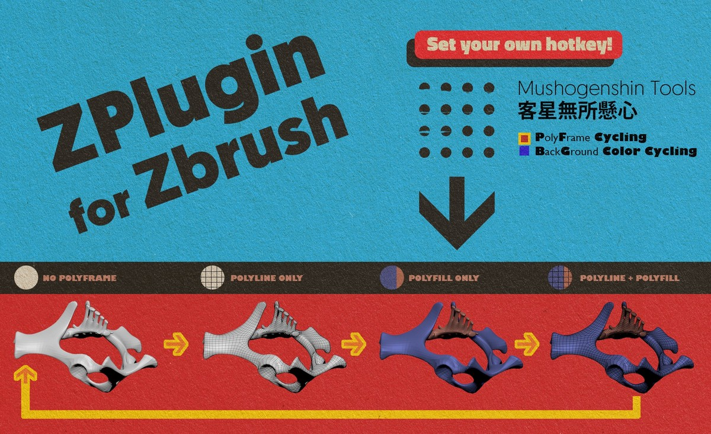
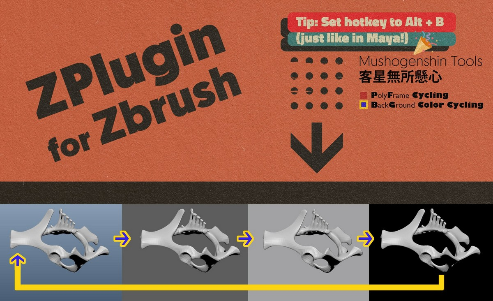

# MushogenshinTools_ZPlugin
Miscellaneous helper functionalities for ZBrush

# Install Instructions:

1. Copy the downloaded file ("MushogenshinTools.zsc") to Pixologic/ZBrush [version]/ZStartup/ZPlugs64/.
2. Restart ZBrush if it's being opened. Then find the plugin in the ZPlugin palette.

# Features

## PF Cycling

Allows for quickly changing the Polyframe display modes, where you can set a same hotkey and use it to cycle through four PF modes:

- Polyline only
- Polyfill only
- Polyline & Polyfill together
- No polyframe at all

## BG Cycling

Allows for quickly change the canvas background colors during sculpting for a better view. I personally set its hotkey to Alt + B, and cycling the four background colors just like I can in Maya!

## Force Toggle Sculptris

Last but not least, included in the ZPlugin is a button to “**Force Toggle Sculptris**”. This allows you to toggle Sculptris with ease of mind, where you don’t have to worry about turning off that `BackfaceMask` in `Brush >> AutoMasking` anymore.

# FEEDBACK
Feel free to report bugs and send me suggestions for improvement, too!